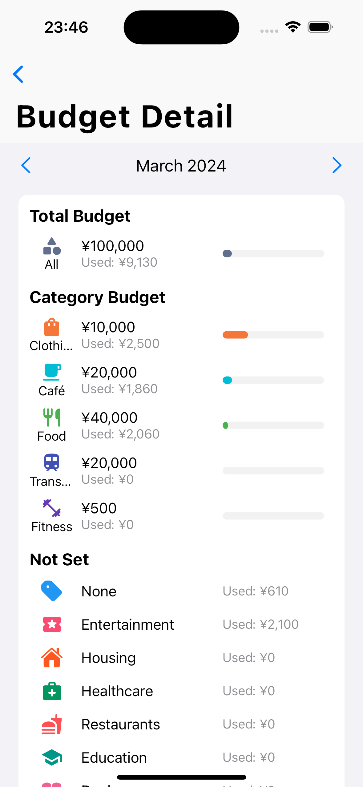

<!-- Title -->
<div align="center">
   <h1 align="center">Kakeibo</h2>
   <p align="center">A personal financing app that helps to keep records of daily expenses and manage budgets</p>
</div>

<!-- About the Project -->
## About The Project

### Home 🏠

<div align="center">
   
</div>

### Budget Detail 💰

<div display="flex" align="center">
   
   
</div>

### New Record ➕

<div display="flex" align="center">
   
</div>

### Record Detail 📝

<div display="flex" align="center">
   
   
</div>

### Statistics 📈

<div display="flex" align="center">
   
</div>

### ChatBot 🤖

<div display="flex" align="center">
   
</div>

### Built with

* [![Dart][Dart-img]][Dart-url]
* [![Flutter][Flutter-img]][Flutter-url]
* [![Sqlite][Sqlite-img]][Sqlite-url]
* [![Gemini][Gemini-img]][Gemini-url]

<!-- Get Started -->
## Get Started (for MacOS)

1. Install flutter & Xcode https://docs.flutter.dev/get-started/install
2. Install Cocoapods https://cocoapods.org/
3. Install all the dependencies by running following commands:
   ```
    cd path/to/flutter_project
    flutter pub get

    cd ios/
    pod install
   ```
4. (Optional) Use hot reload for easier development

**Notice**: our project uses Cocoapods 1.13.0, download the same version. If your Ruby version is not compatible, try using `rbenv` to manage the Ruby environment.


<!-- MARKDOWN LINKS & IMAGES -->
[Flutter-url]: https://flutter.dev/
[Flutter-img]: https://img.shields.io/badge/Flutter-%2302569B.svg?style=for-the-badge&logo=Flutter&logoColor=white
[Dart-url]: https://dart.dev/
[Dart-img]: https://img.shields.io/badge/dart-%230175C2.svg?style=for-the-badge&logo=dart&logoColor=white
[Sqlite-url]: https://www.sqlite.org/
[Sqlite-img]: https://img.shields.io/badge/sqlite-%2307405e.svg?style=for-the-badge&logo=sqlite&logoColor=white
[Gemini-url]: https://gemini.google.com/
[Gemini-img]: https://img.shields.io/badge/Google%20Gemini-8E75B2.svg?style=for-the-badge&logo=Google-Gemini&logoColor=white